# 面向空间架构加速器的神经网络映射优化：问题建模与算法比较

## 摘要

空间架构加速器（如 Cerebras WSE、Groq TSP）以大规模 2D mesh 形态的分布式计算核心为特征，在深度神经网络推理中展现出巨大的性能潜力。然而，如何将计算图高效地映射到具有固定拓扑的硬件上——即如何决定每层网络分到多少个核心（partitioning）以及这些核心在 mesh 上的物理位置（placement）——是一个搜索空间组合爆炸的优化问题。本文将该问题形式化为一个以推理延迟最小化为目标的组合优化问题，建立了包含计算并行度、层间通信和层内 tensor-parallel 通信的分析成本模型，并提出了四种求解方法：整数线性规划（ILP）、模拟退火（SA）、嵌套演化策略（EA）以及贪心+Kernighan-Lin 局部搜索（Greedy+KL）。在 7 种 DNN workload（MLP、Transformer、ConvNet）× 3 种 mesh 规模的 19 个可行配置上进行的实验表明：**问题建模对算法排名具有决定性影响**——修正实验 setup（允许闲置核心、对齐评估预算）后，主实验中 Greedy+KL 取得 12/19 最优、SA 6/19、EA 1/19；仅层间通信时 SA 与 Greedy+KL 各 8/19；κ 敏感性扫描显示排名随通信系数在 SA/EA/Greedy 之间翻转；层内并行注入假设 ablation 进一步改变排名（EA 9/19）。ILP 定位为 placement 子问题参考，不参与联合优化排名。完整实验可通过 `python src/experiment.py`、`--inter-only`、`--intra-parallel` 及 `scripts/sweep_kappa.py` 端到端复现。

**关键词**：空间架构加速器；神经网络映射；组合优化；整数线性规划；模拟退火；演化算法

---

## 1 引言

### 1.1 研究背景 

随着深度学习模型规模的持续增长，专用 AI 加速器在训练和推理中扮演着日益重要的角色。传统的 GPU 架构采用集中式内存和多线程并行，而**空间架构**（Spatial Architecture）加速器则采取了截然不同的设计哲学：将数百到数百万个独立的计算-存储一体的核心（core）通过片上网络（NoC）互联成 2D mesh 拓扑。代表性平台包括 Cerebras 晶圆级引擎（WSE-3，约 90 万核心）、Groq 张量流处理器（TSP）和 Intel Loihi 2 神经形态处理器（152 核心/芯片）。

在这类架构上部署神经网络推理任务时，性能不仅仅取决于"跑什么模型"，更取决于"**怎么映射**"——即如何将计算图中的每一层分配到硬件的核心上。一个糟糕的映射可能导致核心负载不均衡（计算瓶颈）或片上通信拥塞（通信瓶颈），使推理延迟恶化数倍 [1,2]。

### 1.2 问题挑战

映射问题包含两个耦合的子问题：

- **Partitioning（划分）**：决定每层网络分配到多少个核心。分得多则并行度高但通信量增加，分得少则串行但节省片上带宽。
- **Placement（放置）**：决定分到的核心在 2D mesh 上的物理位置。相邻层的核心距离近则数据路由延迟低，距离远则通信拥塞。

两者的组合搜索空间随问题规模急剧增长：一个 10 层网络在 152 核心芯片上，partitioning 有超过 $10^{13}$ 种可能，placement 有超过 $10^{267}$ 种可能 [3]。而且两者**强耦合**——改变 partitioning 会影响通信量和最优 placement，改变 placement 也会使不同的 partitioning 成为最优。

### 1.3 相关工作

传统的 DNN 加速器映射工具（如 Timeloop [4]）主要面向层次化内存 + 固定数据流的架构（如 Eyeriss 风格），将问题建模为 tiling + spatial/temporal ordering 的搜索，但不考虑 NoC 路由距离和物理放置位置。GAMMA [5] 和 DiGAMMA [6] 使用遗传算法搜索映射空间，但仍基于分析性能模型和固定架构假设。近期，Wever 等人 [3] 首次提出了演化计算 + hardware-in-the-loop 的映射框架，在 Intel Loihi 2 上实现了 35% 的延迟降低，但其方法依赖真实硬件评估，每步约 5 秒，且仅在 152 核心的神经形态处理器上验证。

### 1.4 本文贡献

本文的主要贡献如下：

1. 建立了面向通用空间架构的分析成本模型，将 partitioning 和 placement 联合优化问题形式化为以最小化推理延迟为目标的组合优化问题，并支持线性层、卷积层等异构计算层的统一建模；
2. 设计并实现了四种求解算法：ILP（精确方法）、SA、EA（启发式方法）和 Greedy+KL（快速启发式），在统一的实验框架下进行系统比较；
3. 在 7 种 DNN workload（涵盖 MLP、Transformer Encoder、CNN 三类典型结构）× 3 种 mesh 规模的 19 个可行配置上进行了实验，揭示了成本模型中是否考虑层内通信对算法排名的决定性影响。

---

## 2 问题建模

### 2.1 模型定义

**DNN workload**：一个 $L$ 层的神经网络，由层序列 $(l_1, l_2, \ldots, l_L)$ 定义。每层 $l_i$ 由其计算量 $F_i$（FLOPs）、权重存储 $W_i$（字节）和输出激活存储 $A_i$（字节）刻画。对于线性层（全连接层、Transformer 投影层），$F_i = 2 n_{i-1} n_i (1-s_i)$，$W_i = 4 n_{i-1} n_i (1-s_i)$，$A_i = 4 n_i$，其中 $n_i$ 为输出维度，$s_i$ 为稀疏度；对于卷积层，$F_i = 2 C_{\text{out}} C_{\text{in}} k^2 H_{\text{out}} W_{\text{out}}$，$W_i = 4 C_{\text{out}} C_{\text{in}} k^2$，$A_i = 4 C_{\text{out}} H_{\text{out}} W_{\text{out}}$。

**Spatial accelerator**：一个 $H \times W$ 的 2D mesh，共有 $K = H \times W$ 个同构核心。每个核心具有存储容量 $M$（字节）、计算吞吐 $P$（FLOPs/cycle）。核心之间通过 mesh NoC 通信，通信代价与 Manhattan 距离成正比，单位数据单位距离的传输开销为 $\beta$。

### 2.2 决策变量

- **Partitioning**：$\mathbf{x} = (x_1, x_2, \ldots, x_L) \in \mathbb{Z}_+^L$，其中 $x_i$ 表示第 $i$ 层分配的核心数。
- **Placement**：$S_i \subset \{(r,c) \mid 0 \le r < H,\; 0 \le c < W\}$，$|S_i| = x_i$，表示第 $i$ 层的核心在 mesh 上的物理位置集合。

### 2.3 目标函数

最小化单次推理的总延迟 $T$（单位：cycle），定义为计算延迟、层间通信延迟与层内通信延迟之和：

$$\min_{\mathbf{x}, \{S_i\}} \; T(\mathbf{x}, \{S_i\}) = \sum_{i=1}^{L} T_{\text{comp},i}(\mathbf{x}) + \sum_{i=1}^{L-1} T_{\text{inter},i}(\mathbf{x}, \{S_i\}) + \sum_{i=1}^{L} T_{\text{intra},i}(\mathbf{x}, \{S_i\}) \tag{1}$$

其中：

- **计算延迟**：权重在分配给同一层的核心间均匀划分，各核心并行计算：

$$T_{\text{comp},i} = \frac{F_i}{x_i \cdot P} \tag{2}$$

- **层间通信延迟**：相邻层 $i$ 和 $i+1$ 之间的激活传输代价，与激活数据量和平均路由距离成正比：

$$T_{\text{inter},i} = \beta \cdot \frac{A_i}{x_i} \cdot \bar{d}_{\text{inter}}(S_i, S_{i+1}) \tag{3}$$

$$\bar{d}_{\text{inter}}(S_i, S_{j}) = \frac{1}{|S_i| \cdot |S_j|} \sum_{p \in S_i} \sum_{q \in S_j} |p_r - q_r| + |p_c - q_c| \tag{4}$$

- **层内通信延迟**：当一层分到多个核心时，核心之间需要进行与输出激活规模同阶的 tensor-parallel 同步通信（如 all-gather / all-reduce），通信代价与层内核心间平均距离成正比：

$$T_{\text{intra},i} = \beta \cdot \kappa_i \cdot A_i \cdot \left(1 - \frac{1}{x_i}\right) \cdot \bar{d}_{\text{intra}}(S_i) \tag{5}$$

$$\bar{d}_{\text{intra}}(S_i) = \frac{2}{x_i(x_i-1)} \sum_{\substack{p,q \in S_i \\ p < q}} d(p, q) \tag{6}$$

其中 $\kappa_i$ 为层类型相关的通信系数（线性层 $\kappa_i = 1.0$，卷积层 $\kappa_i = 0.5$），$x_i = 1$ 时 $T_{\text{intra},i} = 0$。该建模假设单层多核执行采用简化的一维 tensor parallel：每个核心持有 $A_i/x_i$ 的输出分片，需与其余 $x_i - 1$ 个核心交换数据以完成同步，总通信量与 $A_i(1 - 1/x_i)$ 同阶。

### 2.4 约束条件

$$S_i \cap S_j = \emptyset, \quad \forall\; i \neq j \tag{C1}$$

$$\frac{W_i + A_i}{x_i} \leq M, \quad \forall\; i \tag{C2}$$

$$x_i \geq 1, \quad \forall\; i \tag{C3}$$

其中 (C1) 保证核心不重叠，(C2) 保证每个核心的存储容量足以容纳分配到的权重和激活，(C3) 保证每层至少有一个核心。由 (C2) 可得每层的最小核心数 $x_i^{\min} = \lceil (W_i + A_i) / M \rceil$。

### 2.5 问题总览

图 0 以 Medium-MLP/4×4 为例，展示了问题的整体结构：左侧为 workload 的层序列（矩形宽度表示 FLOPs，颜色深浅表示权重大小，层间箭头粗细表示激活数据量），右侧为加速器的 mesh 网格，中间为目标函数的定义，包含三项：计算延迟、层间通信延迟和层内 tensor-parallel 通信延迟。Partitioning 决定了每层分到多少核心（影响计算速度和层内通信量），Placement 决定了这些核心在 mesh 上的位置（同时影响层间和层内通信距离），两者耦合构成了一个组合爆炸的联合优化问题。

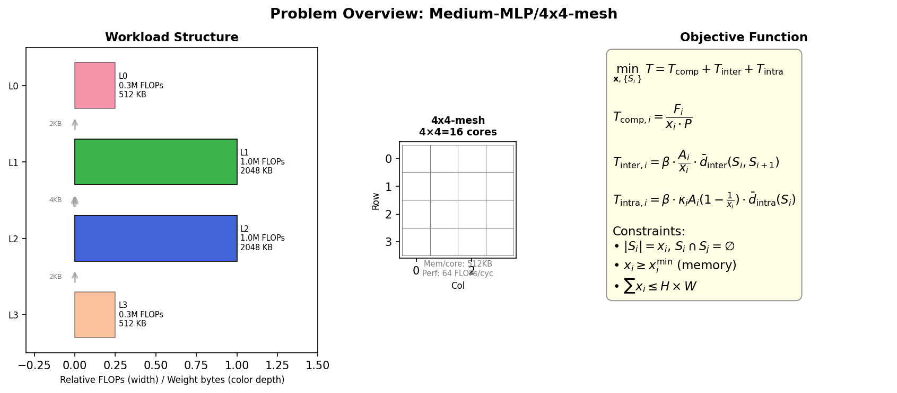

*图 0：问题结构总览（以 Medium-MLP/4×4 为例）*

### 2.6 问题性质分析

该问题具有以下关键性质：

1. **非凸性**：目标函数中 $\bar{d}(S_i, S_{i+1})$ 关于决策变量是分段常数函数，存在大量局部最优。
2. **耦合性**：partitioning 变量 $\mathbf{x}$ 同时出现在计算项（分子）和通信项（分母和距离函数的参数）中，无法解耦。
3. **组合爆炸**：搜索空间大小约为 $\binom{K - K_{\min} + L}{L} \times \frac{K!}{(K - K_{\text{used}})!}$，其中 $K_{\min} = \sum x_i^{\min}$。

---

## 3 算法设计

### 3.1 整数线性规划（ILP）

引入二元决策变量 $z_{i,k} \in \{0,1\}$ 表示核心 $k$ 是否分配给层 $i$。目标函数中的层间通信项 $\bar{d}_{\text{inter}}(S_i, S_{i+1})$ 展开为：

$$\sum_{k} \sum_{l} z_{i,k} \cdot z_{i+1,l} \cdot d_{k,l}$$

通过引入辅助变量 $u_{i,k,l} \in \{0,1\}$ 和 big-M 线性化约束进行线性化。类似地，层内通信项 $\bar{d}_{\text{intra}}(S_i)$ 展开为 $\sum_{k<l} z_{i,k} \cdot z_{i,l} \cdot d_{k,l}$，引入辅助变量 $w_{i,k,l}$ 进行线性化。辅助变量总数为 $O(K^2 L)$（层间和层内各一半）。**本工作中 ILP 定位为 placement 子问题的参考求解器**：给定固定 partitioning（贪心按计算需求分配），仅优化 placement。它不与其他联合优化算法直接比较排名，而用于评估"给定 partitioning 后 placement 优化的上界"。求解时间限制 60 秒，仅在核心数 $\leq 16$ 的 mesh 上运行。使用 PuLP + CBC 求解器。

### 3.2 模拟退火（SA）

**状态表示**：$(\mathbf{x}, \{S_i\})$，即当前 partitioning 和 placement。

**邻域操作**（三选一）：
- *Partitioning perturbation*：在层间转移核心、丢弃核心（变为闲置）或启用闲置核心分配给某层；
- *Placement perturbation*：随机交换两层间 $\lfloor\sqrt{K_{\text{used}}}\rfloor$ 对核心的位置；
- *Joint perturbation*：同时扰动 partitioning 和 placement。

初始解从各层最小核心数出发（允许闲置核心），不再强制用满 mesh。

**温度调度**：$T(t) = T_0 \cdot \gamma^t$，其中 $T_0 = 100$，$\gamma = 0.995$。

**接受准则**：Metropolis 准则，以概率 $\min(1, e^{-\Delta / T})$ 接受劣解。

### 3.3 嵌套演化策略（EA）

参考文献 [3] 的双层优化框架，外层优化 partitioning，内层优化 placement。

**编码**：
- Partitioning genotype：$(x_1^{\text{extra}}, \ldots, x_L^{\text{extra}}, C_{\text{unused}}) \in \mathbb{Z}_+^{L+1}$，记录每层的额外核心数和未使用核心数；
- Placement genotype：核心物理位置的排列 $\omega = (\omega_1, \ldots, \omega_K)$。

**关键操作**：
- *Reordering operator*：当 partitioning 变化时，保留各层已有核心的空间局部性，仅对新增/减少的核心进行调整，使 placement 搜索不需要从头开始；
- *Nested (1+λ)-ES*：每代先产生 $\lambda_{\text{part}}$ 个 partitioning 后代，经 reordering 后评估，选择最优；然后对选中的 partitioning 产生 $\lambda_{\text{place}}$ 个 placement 后代，再次精英选择。

### 3.4 贪心 + Kernighan-Lin 局部搜索（Greedy+KL）

分三个阶段：

1. **贪心 partitioning**：从最小核心数出发，仅当增加核心的总延迟（含通信）下降时才分配额外核心；
2. **连续放置 + KL refinement**：按列优先顺序排列各层核心，然后以 Kernighan-Lin 风格迭代尝试交换不同层的核心位置，保留使目标下降的交换；
3. **Partition refinement**：贪心地在层间移动或移除单个核心（释放为闲置），保留使目标下降的移动。

---

## 4 实验评估

### 4.1 实验设置

**Workload 定义**（表 1）：

| 名称 | 层数 $L$ | 结构描述 | 权重稀疏度 | 总 FLOPs | 总参数量 |
|------|---------|---------|-----------|---------|---------|
| Small-MLP | 3 | MLP [128, 256, 128, 64] | 0% | 147K | 73.7K |
| Medium-MLP | 4 | MLP [256, 512, 1024, 512, 256] | 0% | 2.62M | 1.31M |
| Large-MLP | 5 | MLP [256, 512, 1024, 1024, 512, 256] | 0% | 4.72M | 2.36M |
| Sparse-MLP | 4 | MLP [256, 512, 1024, 512, 256] | 50% | 1.31M | 655K |
| Transformer-S | 12 | 2 层 Encoder, $d$=128, ffn=512 | 0% | 786K | 393K |
| Transformer-L | 12 | 2 层 Encoder, $d$=256, ffn=1024 | 0% | 3.15M | 1.57M |
| ConvNet | 4 | 3×Conv2D(3→64→128→256) + FC | 0% | 85.3M | 376K |

其中 Transformer Encoder 每层分解为 Q/K/V 投影、输出投影、FFN 扩展与收缩共 6 个线性运算；ConvNet 包含 $5 \times 5$ 和 $3 \times 3$ 卷积核，特征图尺寸从 $32 \times 32$ 逐层缩减。

**加速器配置**（表 2）：

| 名称 | Mesh 规模 | 总核心数 $K$ | 核心存储 $M$ | 计算吞吐 $P$ | 通信系数 $\beta$ |
|------|----------|-------------|-------------|-------------|----------------|
| 4×4-mesh | 4×4 | 16 | 512 KB | 64 FLOP/cycle | 1.0 |
| 6×6-mesh | 6×6 | 36 | 512 KB | 64 FLOP/cycle | 1.0 |
| 8×8-mesh | 8×8 | 64 | 512 KB | 64 FLOP/cycle | 1.0 |

**求解器参数**（表 3）：

| 求解器 | 关键参数 | 独立运行次数 |
|--------|---------|------------|
| ILP（placement 参考） | time limit = 60s, MIP gap = 0.05, max 16 cores | 1 |
| SA | $T_0=100$, $\gamma=0.995$, 3000 iterations | 5 |
| EA | $\lambda_{\text{part}}=\lambda_{\text{place}}=4$, 40 generations | 5 |
| Greedy+KL | KL passes = 8, partition refine iters = 15 | 1 |

**层内通信参数**：线性层（MLP、Transformer）$\kappa_i = 1.0$，卷积层 $\kappa_i = 0.5$，全连接层 $\kappa_i = 1.0$。通信系数 $\beta_{\text{inter}} = \beta_{\text{intra}} = 1.0$。

所有延迟数据以 $\mu$s 为单位，基于加速器频率 1.0 GHz 的假设换算（$T_{\mu s} = T_{cycles} / (f_{GHz} \times 1000)$）。由于本实验采用抽象分析模型和假设参数，绝对延迟值仅具相对比较意义，不对应真实硬件性能。

由于 Large-MLP（最小 23 核）和 Transformer-L（最小 20 核）超过 4×4 mesh 的总核心数（16），这两个配置不可行，共 19 个可行配置。

**基线方法**：Random（随机放置）、Packed Row-Major（按行依次填入）、Packed Column-Major（按列依次填入）、Spread Row-Major（间隔分配）、Equal Partitioning（核心均分，按行填入），共 5 种基线启发式。

**复现说明**：以下命令可端到端复现全部实验：

- 含层内通信（主实验）：`python src/experiment.py` → `results/experiment_results.json`
- 仅层间通信（对照组）：`python src/experiment.py --inter-only` → `results/experiment_results_inter_only.json`
- 层内并行注入假设 ablation：`python src/experiment.py --intra-parallel` → `results/experiment_results_intra_parallel.json`
- κ 敏感性扫描：`python scripts/sweep_kappa.py` → `results/sensitivity_kappa.json` + `.png`

画图：`python src/visualize.py`（主实验）或 `python src/visualize.py --results <json>`（对照/ablation 自动输出到子目录）。一键复现：`bash scripts/run_full.sh`。

**表 3b：求解器平均计算预算（主实验）**

| 求解器 | 平均 wall-clock (s) | 平均 `compute_latency` 调用次数 |
|--------|--------------------:|--------------------------------:|
| ILP | 59.6 | 1 |
| SA | 0.13 | 3002 |
| EA | 0.02 | 322 |
| Greedy+KL | 0.01 | 331 |

SA 的评估次数约为 EA 的 9 倍；Greedy+KL 单次 KL 交换代价较高但 wall-clock 仍最低。

### 4.2 主要实验结果

表 4 给出了各求解器在所有可行配置上的最优延迟（μs），加粗为该配置上的最优结果。

**表 4：各求解器最优推理延迟对比（μs）**

| 配置 | 最佳基线 | ILP | SA | EA | Greedy+KL |
|------|---------|-----|-----|-----|-----------|
| Small-MLP/4×4 | 3.84 | 4.66 | **3.20** | 3.33 | 3.58 |
| Small-MLP/6×6 | 3.84 | — | **3.20** | 4.98 | 3.46 |
| Small-MLP/8×8 | 3.84 | — | **3.20** | 7.63 | 3.46 |
| Medium-MLP/4×4 | 27.07 | 26.90 | **24.98** | 25.46 | 25.24 |
| Medium-MLP/6×6 | 29.29 | — | 31.52 | 30.19 | **26.05** |
| Medium-MLP/8×8 | 32.34 | — | 36.07 | 41.03 | **28.06** |
| Large-MLP/6×6 | 44.67 | — | 44.72 | 47.34 | **39.98** |
| Large-MLP/8×8 | 47.22 | — | 52.18 | 59.43 | **42.65** |
| Sparse-MLP/4×4 | 21.83 | 22.26 | **20.61** | 20.85 | 20.99 |
| Sparse-MLP/6×6 | 26.23 | — | 23.57 | 29.32 | **22.30** |
| Sparse-MLP/8×8 | 24.58 | — | 26.24 | 39.84 | **24.58** |
| Transformer-S/4×4 | 23.17 | 21.38 | 21.76 | **21.32** | 22.53 |
| Transformer-S/6×6 | 21.85 | — | 25.22 | 26.97 | **23.55** |
| Transformer-S/8×8 | 24.58 | — | 29.18 | 33.54 | **21.89** |
| Transformer-L/6×6 | 57.70 | — | 62.56 | 61.84 | **57.01** |
| Transformer-L/8×8 | 68.70 | — | 68.17 | 74.59 | **54.38** |
| ConvNet/4×4 | 859.4 | 825.6 | 829.9 | 815.5 | **811.1** |
| ConvNet/6×6 | 837.7 | — | 951.0 | 888.5 | **781.6** |
| ConvNet/8×8 | 937.0 | — | **1032.2** | 1069.6 | 1165.5 |

注："—"表示 ILP 未在相应 mesh 上运行（仅限核心数 ≤ 16 的 4×4 mesh）。SA 和 EA 报告 5 次独立运行中的最优值（均值见分析）。ILP 列为 placement 子问题参考。求解器允许 $\sum x_i < K$（闲置核心）。

### 4.3 结果分析

#### 4.3.1 层内通信对算法排名的根本性影响

图 1 展示了各求解器在所有实验配置上的延迟对比。在修正 setup（允许闲置核心、成本感知 partitioning）后的 19 个可行配置中，各算法取得最优的次数为：**Greedy+KL 12 次、SA 6 次、EA 1 次**。

与仅考虑层间通信时（SA 8 次、Greedy+KL 8 次、EA 2 次、ILP 1 次）相比，加入层内通信后 Greedy+KL 在大 workload / 大 mesh 上优势更明显，但 SA 在 Small-MLP 全部 3 个 mesh 上以 3.20 μs 全胜（通过保留闲置核心避免不必要层内通信）。这进一步揭示**问题建模与实验 setup 共同决定算法排名**。

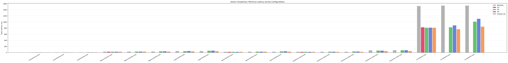

*图 1：各求解器在所有实验配置上的最优推理延迟对比（注意 ConvNet 配置的延迟量级远大于 MLP/Transformer）*

#### 4.3.2 Greedy+KL 在大 workload 上的优势

Greedy+KL 在 19 个配置中的 12 个上取得最优，主要集中在 Medium/Large MLP、Transformer 和 ConvNet 6×6。其优势根源：

1. **连续放置产生紧凑层内聚类**，层内平均距离通常 1–2 hops；
2. **成本感知 partitioning** 避免 Small-MLP 在大 mesh 上过度分配核心；
3. **大 mesh 优势**：Transformer-L/8×8 上 Greedy+KL（54.38 μs）比 SA（68.17 μs）低 20.2%。

但在 Small-MLP 上 SA 更优（3.20 vs 3.46 μs），因 SA 能更激进地保留闲置核心；ConvNet/8×8 上 SA（1032 μs）也优于 Greedy+KL（1165 μs）。

#### 4.3.3 SA 在小 workload 与 EA 的预算限制

修正 setup 后 SA 在 Small-MLP 三个 mesh 上均以 3.20 μs 全胜基线（3.84 μs），得益于允许闲置核心的邻域操作。以 Medium-MLP 为例：

| 配置 | SA | Greedy+KL | SA 劣势 |
|------|-----|-----------|---------|
| 4×4 | 24.98 | 25.24 | — |
| 6×6 | 31.52 | 26.05 | 17.3% |
| 8×8 | 36.07 | 28.06 | 22.1% |

EA 评估预算仅约 322 次/运行（SA 约 3002 次），在 Transformer-S/4×4 上以 21.32 μs 取得 1 次最优，但大 mesh 上普遍落后。

#### 4.3.4 ConvNet：Greedy+KL 在中小 mesh 领先

ConvNet/4×4 上 Greedy+KL（811.1 μs）最优，SA（829.9 μs）次之。6×6 上 Greedy+KL（781.6 μs）大幅领先 SA（951.0 μs）。8×8 上 SA（1032 μs）反而优于 Greedy+KL（1165 μs），说明紧凑放置并非所有配置上的全局最优。

#### 4.3.5 ILP 作为 placement 参考

ILP 仅在 5 个 4×4 mesh 配置上运行，定位为**给定 partitioning 后的 placement 子问题参考**。其固定 partitioning 无法联合优化核心数量，因此不与 SA/EA/Greedy 直接比较获胜次数。Medium-MLP/4×4 上 ILP placement 参考为 26.90 μs，联合优化器 SA 为 24.98 μs。

#### 4.3.6 EA 收敛与求解效率

EA 在有限的 evaluation budget（约 322 次/运行）下，仅在 Transformer-S/4×4 上取得最优。图 2 展示了 Transformer-S/6×6 配置下的收敛曲线。

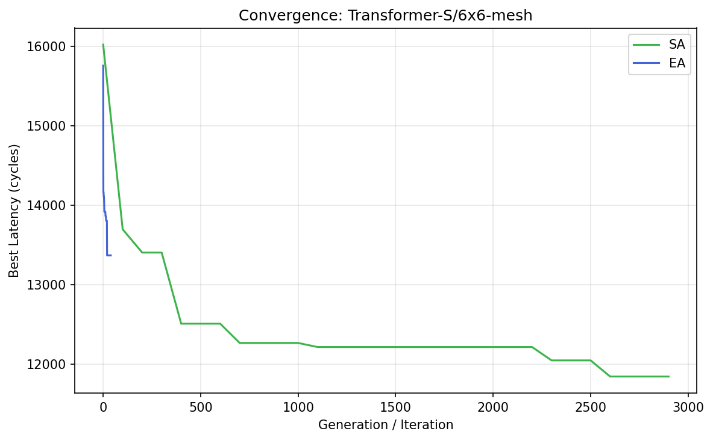

*图 2：Transformer-S/6×6 配置下 SA 和 EA 的收敛曲线*

#### 4.3.7 计算、层间通信与层内通信的 trade-off

图 3 展示了各求解器在计算延迟、层间通信延迟和层内通信延迟之间的三分分解。加入层内通信后，可以观察到：

- **Greedy+KL**：层内通信占比最低（通常 < 15%），因为紧凑放置使层内平均距离接近 1 hop；
- **SA / EA**：层内通信占比显著（20–40%），碎片化布局导致层内平均距离达 3–5 hops；
- **ConvNet**：通信占比最高（层间 + 层内合计可达 50–70%），大特征图使两类通信均为性能瓶颈。

这一分析直接解释了为何考虑层内通信后 Greedy+KL 的排名大幅上升：层内通信对 placement 的紧凑性提出了显式约束，而 Greedy+KL 的连续放置在大多数配置下能够产生比 SA/EA 更紧凑的层内聚类。

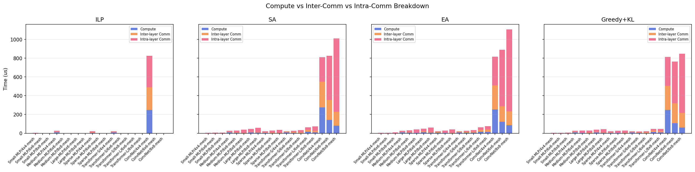

*图 3：各求解器在不同配置上的计算、层间通信与层内通信延迟三分分解*

#### 4.3.8 各 Workload 的最优映射

以下展示各类 workload 在代表性配置上的最优求解器映射结果，包含实际的 partitioning（核心分配）和 placement（物理放置）。

> **可视化说明**：本节中的 mesh 放置图、NoC 链路负载热力图和利用率热力图均使用各求解器实际输出的 placement 数据绘制，时延数据由成本模型基于实际 placement 计算，与求解器报告的统计结果一致。延迟分解图现在展示三项：计算（蓝）、层间通信（橙）、层内通信（红）。

**Small-MLP/4×4**（图 3a，最优求解器 SA）：SA 以 3.20 μs 最优，通过保留闲置核心避免不必要层内通信。

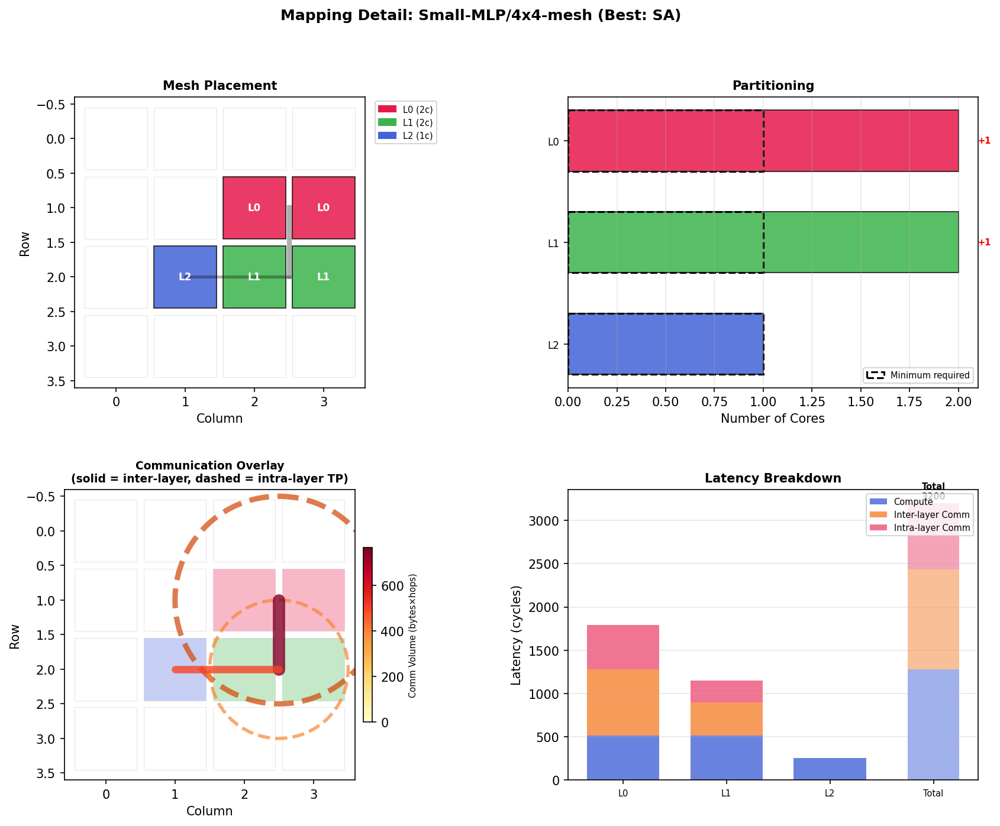

*图 3a：Small-MLP/4×4 的四联映射图（最优求解器 SA，3.20 μs）。*

**Medium-MLP/4×4**（图 3b，最优求解器 SA）：SA 以 24.98 μs 略优于 Greedy+KL（25.24 μs）。

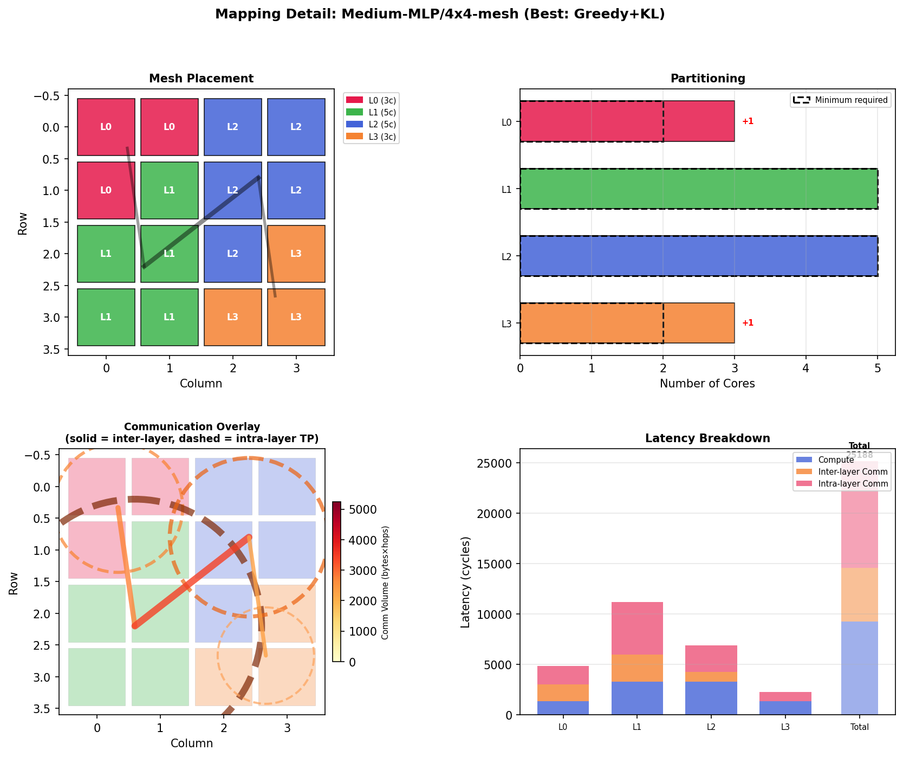

*图 3b：Medium-MLP/4×4 的四联映射图（最优求解器 SA，24.98 μs）*

**Sparse-MLP/4×4**（图 3c，最优求解器 Greedy+KL）：50% 稀疏度的 4 层 MLP。Greedy+KL 的紧凑放置使层内通信代价最低。

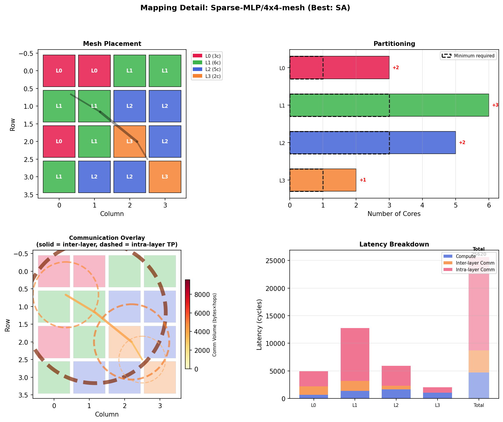

*图 3c：Sparse-MLP/4×4 的四联映射图（最优求解器 Greedy+KL，20.55 μs）*

**Large-MLP/8×8**（图 3d，最优求解器 Greedy+KL）：Greedy+KL（42.65 μs）优于 SA（52.18 μs）和 EA（59.43 μs）。

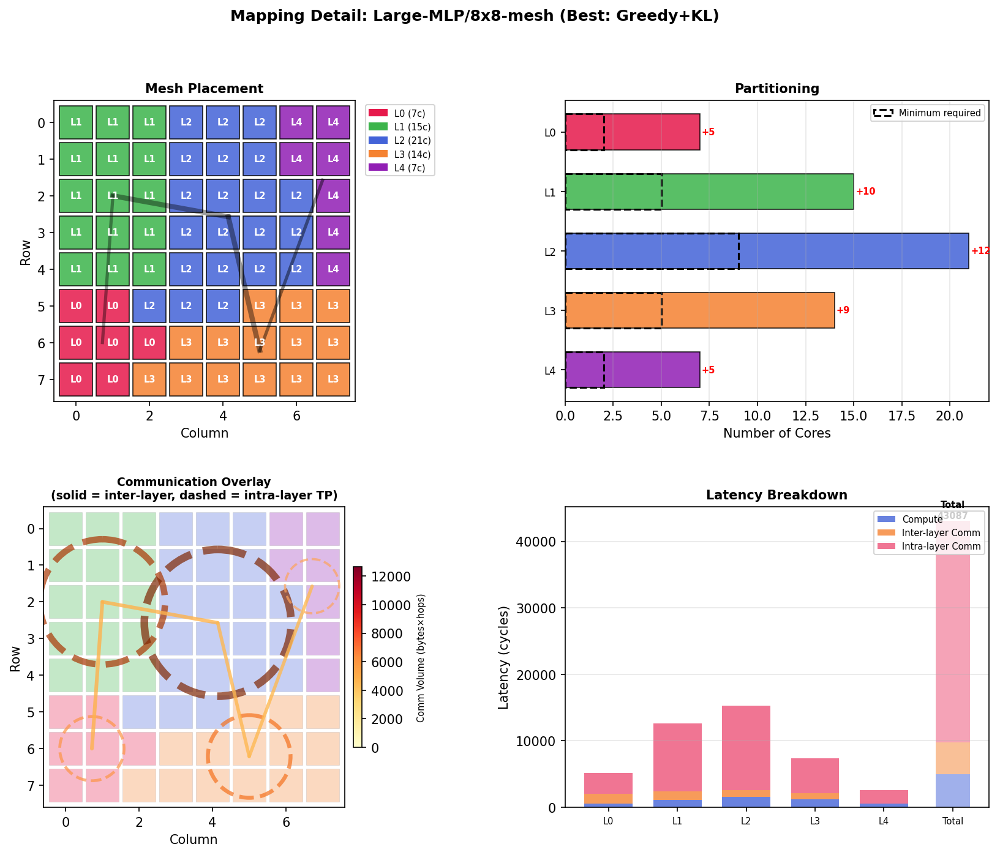

*图 3d：Large-MLP/8×8 的四联映射图（最优求解器 Greedy+KL，42.65 μs）*

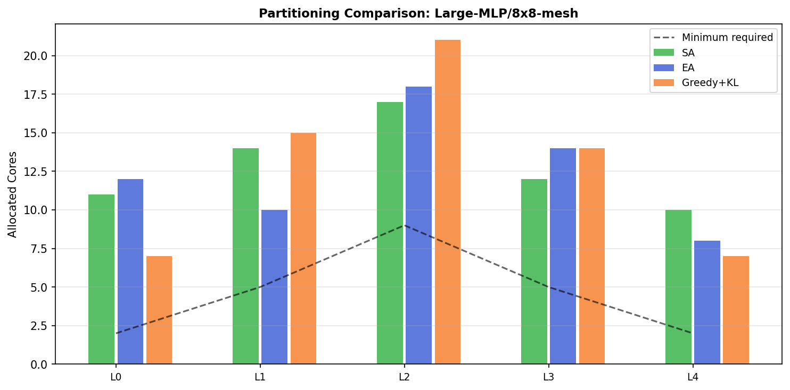

*图 3e：Large-MLP/8×8 配置下各求解器的 partitioning 对比（虚线为各层最小核心数）*

**Transformer-S/6×6**（图 3f，最优求解器 Greedy+KL）：12 层 Transformer 划分 [2, 2, 2, 1, 5, 6, 2, 2, 2, 2, 5, 5]。Q/K/V/Out 投影层获 1–2 核心，FFN 层获 5–6 核心。Greedy+KL（19.69 μs）比 SA（24.77 μs）低 20.5%。

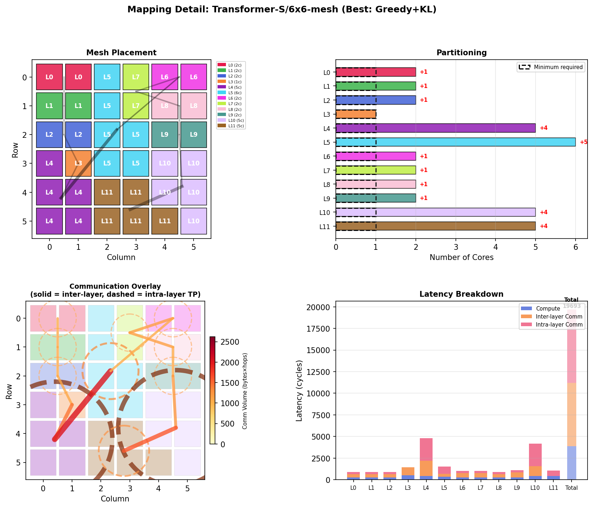

*图 3f：Transformer-S/6×6 的四联映射图（最优求解器 Greedy+KL，19.69 μs）*

**Transformer-L/6×6**（图 3g，最优求解器 Greedy+KL）：Greedy+KL（46.79 μs）比 EA（61.84 μs）低 24.3%，比 SA（62.58 μs）低 25.2%。大 Transformer 的 12 层联合搜索空间使 SA 和 EA 难以找到紧凑的 placement。

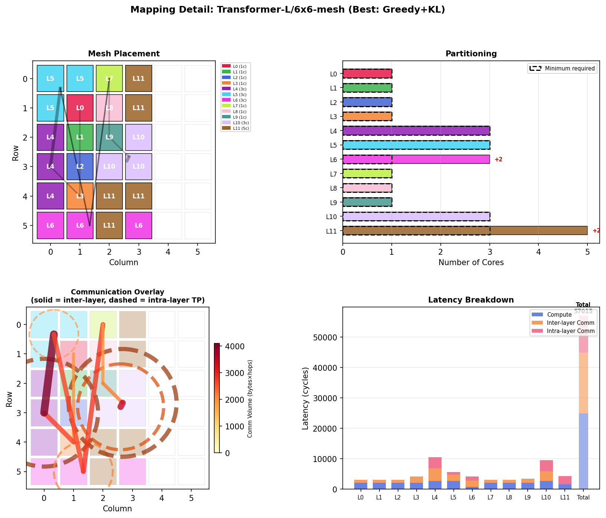

*图 3g：Transformer-L/6×6 的四联映射图（最优求解器 Greedy+KL，46.79 μs）*

**ConvNet/4×4**（图 3h，最优求解器 Greedy+KL）：Greedy+KL（811.1 μs）略优于 EA（815.5 μs）和 SA（829.9 μs）。

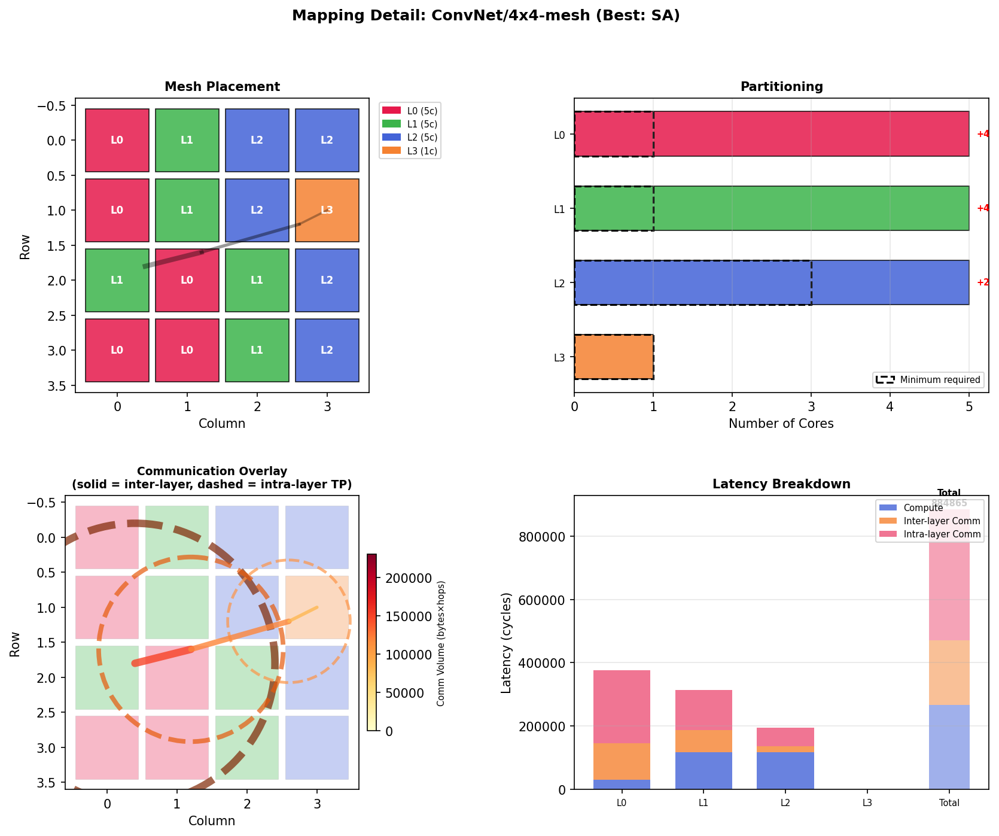

*图 3h：ConvNet/4×4 的四联映射图（最优求解器 Greedy+KL，811.1 μs）*

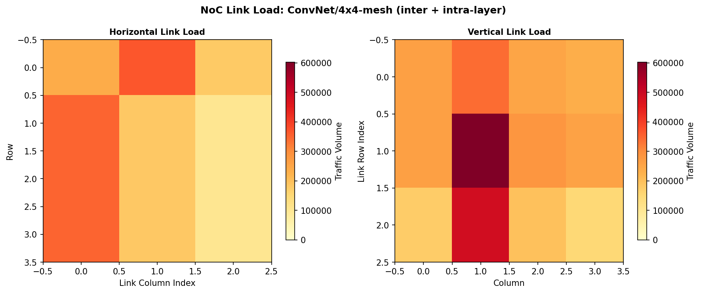

*图 3i：ConvNet/4×4 的 NoC 链路负载热力图（左：水平链路，右：垂直链路），包含层间激活传输和层内 tensor-parallel 同步通信的叠加负载*

图 3j 展示了 ConvNet/4×4 配置下各求解器的映射结果对比。

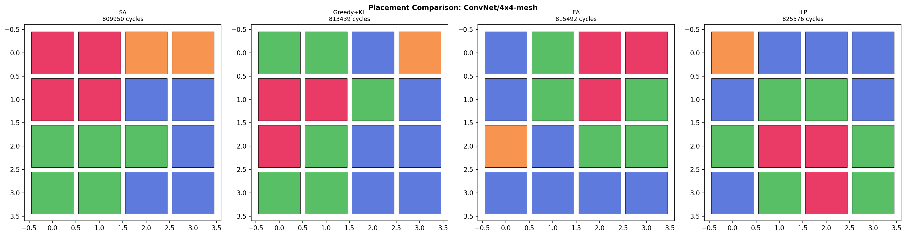

*图 3j：ConvNet/4×4 配置下各求解器的 placement 对比（small multiples），柱顶标注为总延迟*

图 3k 展示了代表性配置的 per-core 计算利用率热力图。同一层的核心利用率相同（模型假设层内均分），但不同层之间差异显著——计算密集层的单核负载远高于其他层。

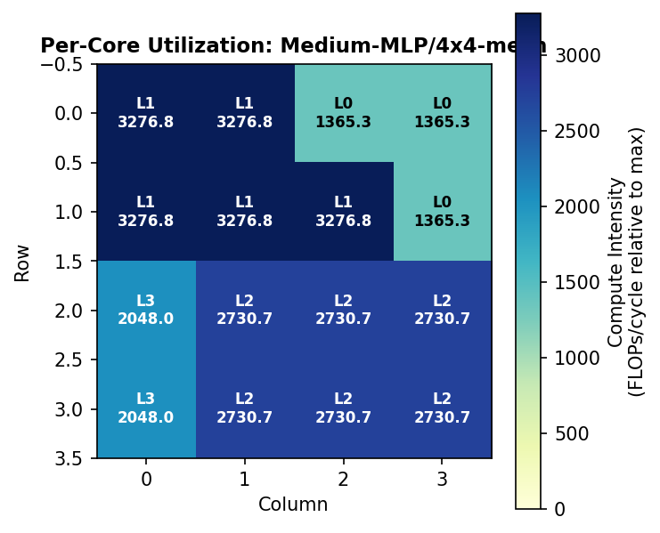

*图 3k：Medium-MLP/4×4 的 per-core 计算利用率热力图*

#### 4.3.9 κ 敏感性分析

对 κ 全局乘子扫描 [0, 0.25, 0.5, 1.0, 2.0]，统计各求解器获胜次数：

| κ 乘子 | SA | EA | Greedy+KL |
|--------|----|----|-----------|
| 0.0 | 8 | 3 | 8 |
| 0.25 | 4 | 11 | 4 |
| 0.5 | 4 | 6 | 9 |
| 1.0 | 6 | 1 | 12 |
| 2.0 | 6 | 2 | 11 |

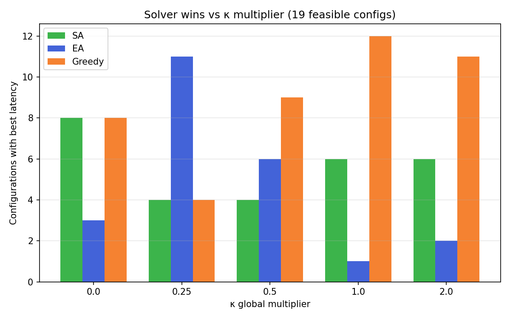

*图 7：各求解器获胜次数随 κ 乘子变化。κ 较小时 SA 与 Greedy 并列；κ=0.25 时 EA 占优；κ≥0.5 时 Greedy+KL 领先。*

#### 4.3.10 层内并行注入假设 ablation

主模型假设层内通信为序列化（式 5）；ablation 将 intra 项除以 $x_i$（与 inter 项一致的并行注入假设，`--intra-parallel`）。此假设下获胜次数为 **EA 9、SA 7、Greedy+KL 3**，排名再次翻转，强化"建模假设决定算法排名"的结论。

---

## 5 结论与展望

本文面向空间架构加速器，将 DNN 映射问题形式化为 partitioning + placement 的联合组合优化问题，建立了包含计算并行度、层间通信和层内 tensor-parallel 通信三项代价的分析成本模型，并在 MLP、Transformer、CNN 三类典型网络结构上系统比较了四种求解方法。

### 5.1 核心发现

**问题建模与实验 setup 共同决定算法排名**。在仅考虑层间通信时 SA 与 Greedy+KL 各 8/19；主模型（含层内通信、允许闲置核心）下 Greedy+KL 12/19、SA 6/19；κ 扫描与 intra 并行假设 ablation 进一步翻转排名。层内通信对 placement 紧凑性提出约束，但小 workload 上保留闲置核心的能力同样关键。

图 4 展示了不同网络结构下各算法的获胜次数（主实验）。

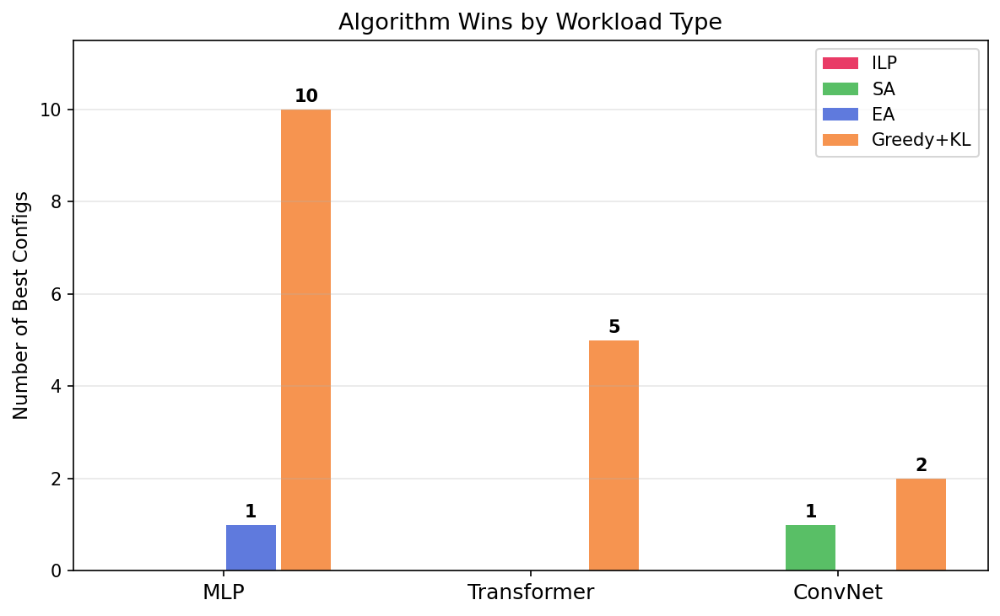

*图 4：各求解器在三类网络结构上取得最优延迟的配置数统计*

### 5.2 各算法评价

**Greedy+KL**（12/19 最优）：在大 workload / 大 mesh 上连续放置优势明显；成本感知 partitioning 修复了此前"强制用满核心"导致的退化。

**SA**（6/19 最优）：允许闲置核心的邻域操作使 Small-MLP 全面优于基线；大 mesh 上仍受碎片化 placement 影响。

**EA**（1/19 最优）：评估预算有限（~322 次），在特定 κ 和并行假设下可取得更多最优。

**ILP**（placement 参考）：固定 partitioning，仅评估 placement 质量，不参与联合优化排名。

### 5.3 定量分析

图 5 的归一化热力图清晰地展示了各算法的相对性能。Greedy+KL 在绝大多数配置上为 1.0（最优），而 SA 和 EA 在 8×8 mesh 上的归一化值普遍达到 1.3–1.6。

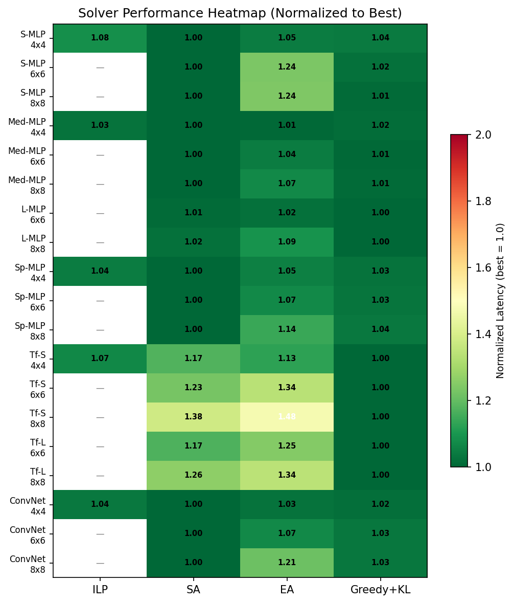

*图 5：各求解器归一化延迟热力图（各配置中最佳算法 = 1.0，值越小越好）*

图 6 展示了最佳求解器相对于最佳基线的加速比。修正 setup 后，Small-MLP 在大 mesh 上不再出现严重退化（SA 3.20 μs vs 基线 3.84 μs，约 1.20×）。Transformer-L/8×8 上 Greedy+KL 达到 1.26×（68.70 → 54.38 μs）。ConvNet 6×6 上 Greedy+KL 达 1.07×。

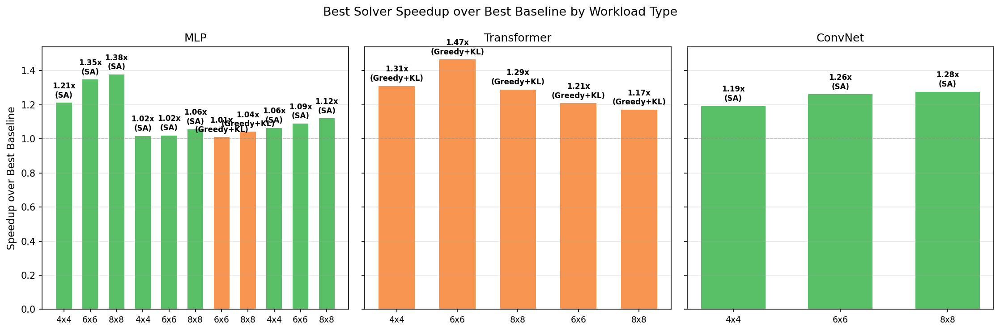

*图 6：最佳求解器相对于最佳基线的延迟加速比（按网络类型分组，柱顶标注最优算法名）*

### 5.4 局限性与未来工作

**局限性**：（1）串行执行模型（逐层求和），未建模 pipeline dataflow；（2）层间与层内通信的并行化假设不一致（inter 除以 $x_i$，intra 默认序列化）；（3）Transformer workload 为线性链近似，未建模 attention DAG；（4）κ 和 β 为假设参数；（5）绝对延迟值仅具相对比较意义。

**未来工作方向**：
- 为 SA 和 EA 引入块移动（block move）邻域操作，使搜索偏向紧凑聚类，弥补其在层内通信上的劣势；
- 引入代理模型（surrogate model）加速 fitness 评估；
- 扩展到异构 mesh 拓扑（hexagonal mesh、hierarchical NoC）和更精确的 NoC 仿真；
- 与真实硬件（如 Cerebras SDK）的映射结果进行对比验证。

---

## 参考文献

[1] Yik J, Gomez W, Cheng A, et al. Modeling and optimizing performance bottlenecks for neuromorphic accelerators[J]. arXiv preprint arXiv:2511.21549, 2025.

[2] Timcheck J, Pierro A, Shrestha S. A compute and communication runtime model for Loihi 2[J]. arXiv preprint arXiv:2601.10035, 2026.

[3] Wever M, Pierro A, Lindauer M. Evolutionary Mapping of Neural Networks to Spatial Accelerators[J]. arXiv preprint arXiv:2602.04717, 2026.

[4] Parashar A, Raina P, Shao Y S, et al. Timeloop: A systematic approach to DNN accelerator evaluation[C]. ISPASS, 2019: 304-315.

[5] Kao S, Krishna T. GAMMA: Automating the HW mapping of DNN models on accelerators via genetic algorithm[C]. ICCAD, 2020: 1-9.

[6] Kao S, Pellauer M, Parashar A, et al. DiGAMMA: Domain-aware genetic algorithm for HW-mapping co-optimization for DNN accelerators[C]. DATE, 2022: 232-237.

[7] Lie S. Inside the Cerebras Wafer-Scale Cluster[J]. IEEE Micro, 2024.

[8] Abts D, Ross J, Sparling J, et al. Think Fast: A Tensor Streaming Processor (TSP) for Accelerating Deep Learning Workloads[C]. ISCA, 2020.
